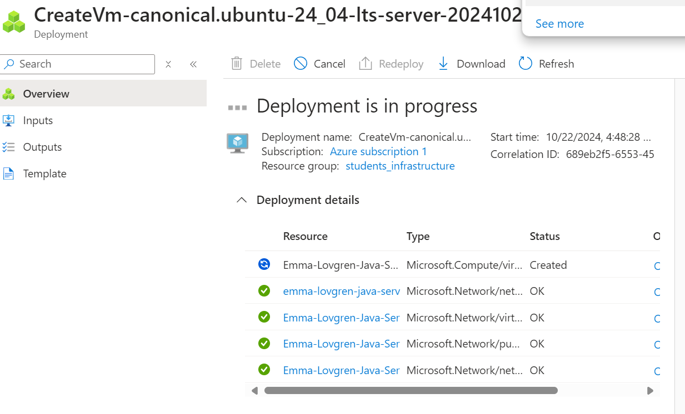
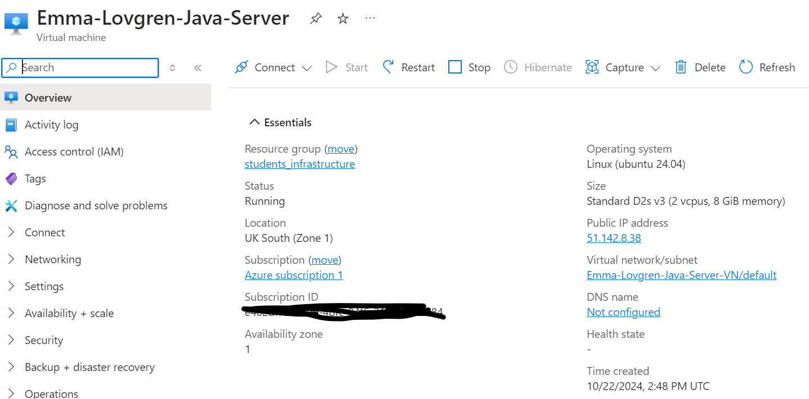
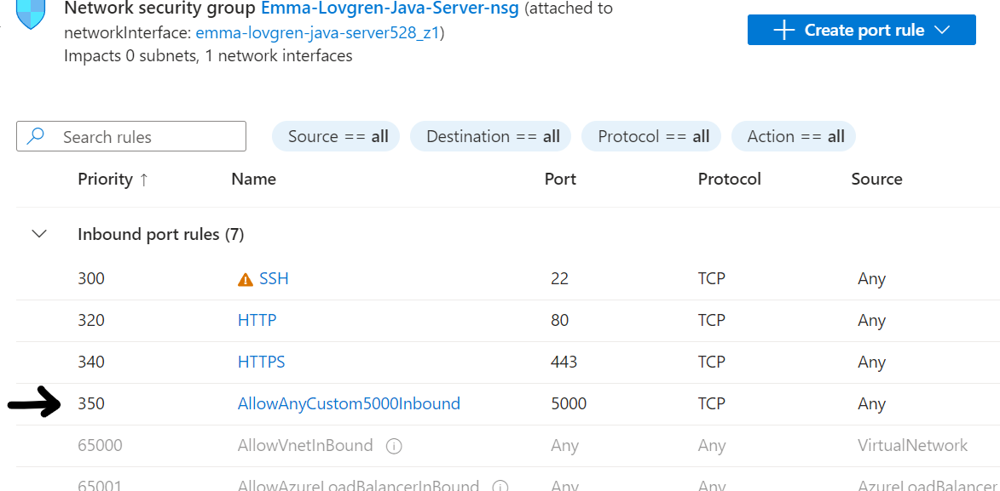
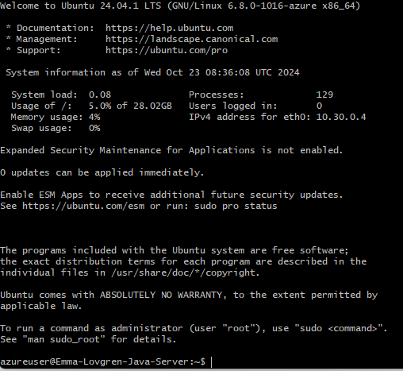
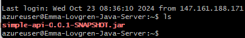
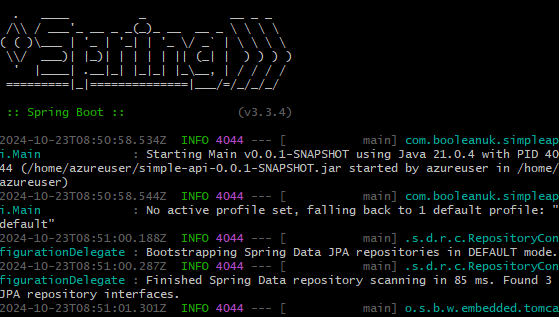

# Submission

1. Create VM on azure:  
    Region: (Europe) UK South  
    Inbound ports HTTP, HTTPS, SSH

2. Check VM Overview

3. Add Inbound Role (changed this to port 4000 later)

NOTE! The VM got deleted before I could move on to thi next step, did the above steps again and then proceeded with the following steps.  
4. SSH into VM

5. sudo apt install java  

6. Copied over jar file  

6. Run Java on VM  
